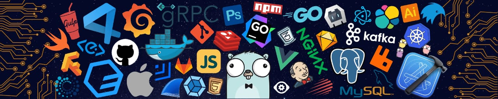

 <!-- Banner & Links -->

 

 <!-- Banner & Links -->

 <!-- Heading and BIO -->

<h1 align="center">Hi👋, I am Aniket Wani</h1>

  Incoming <b>Associate Software Engineer</b> at
  <a herf="https://www.linkedin.com/company/maq-software/"><b>MAQ Software</b></a>.  
  Besides, I have completed my graduation in <b>Computer Science and Engineering</b> from <b>National Institute of Technology, Nagpur </b>.  

 <!-- Heading and BIO -->

 <!-- Profile Views - Waka Time Stats - Followers & Stars -->

 <!-- Profile Views - Waka Time Stats - Followers & Stars -->

 <!-- Github Readme Stats -->

  <!-- Github Profile Summary Cards -->

 

  <!-- Github Profile Summary Cards -->

<!-- Contact Section -->

## 📞 Connect with me

<!-- Contact Section -->

 <!-- Achievement Corner -->
 <!--Hacktober Fest-->

 <!--Hacktober Fest-->

 <!--Google Foobar -->

 <!--Google Foobar -->
 <!-- Achievement Corner -->
 

 <!-- Banners 2nd Phase -->

 <!-- Banners 2nd Phase -->
 

 <!-- Typewriting Introduction -->

 <!-- Typewriting Introduction -->

 <!-- Banners 3rd Phase : About Me -->

 <!-- Banners 3rd Phase : About Me -->

 <!-- About Me -->

- 🔭 <b>Computer Science Grad</b>   from <b> NIT Nagpur </b> 
- 🌱 I’m currently exploring and learning in depth backend 😁 
- ✨ Also focusing on problem-solving and System Design 
- ⚡ Interests : Machine Learning and Artificial Intelligence! 😏 

 <!-- About Me -->

<!-- Skill Section -->

## <i> Skills: </i>

<!-- Banners 4th Phase : SpiderMan -->

<!-- Banners 4th Phase : SpiderMan -->

#### 🦖 Competitive Programming

- 
  
  

#### 📚 Frontend Development & Frameworks

- 
  
  
- 
  
  
- 
  
  

#### ⛏️ Backend Development & Database Services

- 
  
  
- 
  
  
- 
  
  
  

#### 😡 App Development

- 
  
  
- 
  
  
  

#### 🚦 Version Control & Documentation Tools

- 
  
  
- 
  
  

<!-- Skill Section -->

<!-- Contribution Stack -->
<h1 align="center"><b><i>Contribution Stack ✌️</i></b> </h1>

<!-- Contribution Statistics and Visuals -->

 

<!-- Contribution Statistics and Visuals -->

<!-- Activity Graph -->

<!-- Activity Graph -->

<!-- <h4 align="center"> 🏆 Best Projects </h4>

 -->

